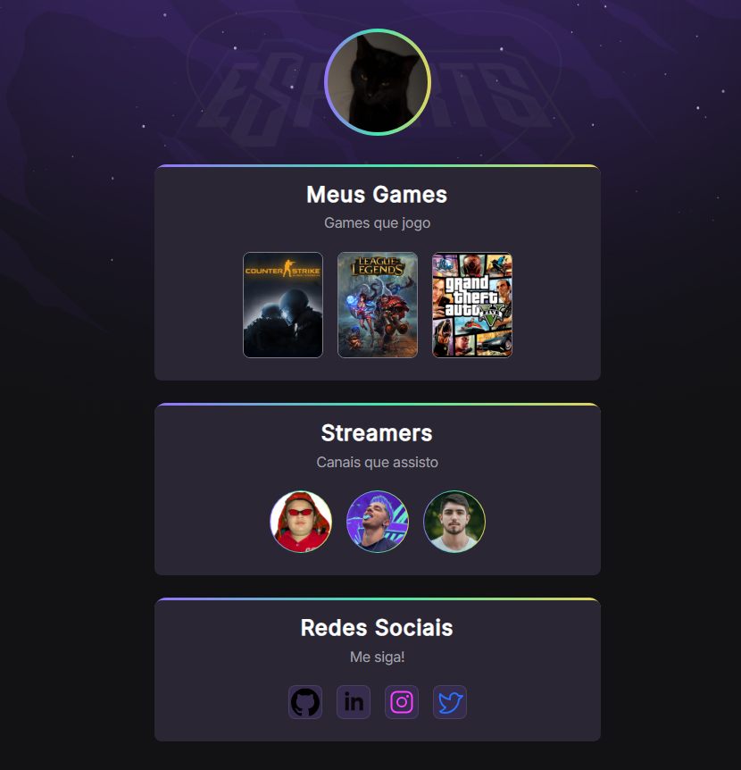

# 📌 NLW eSports
> NLW eSports is an interactive portfolio project that displays information about the user’s favorite games, streamers they follow, and their social media accounts. The website was developed using HTML, CSS, and animations to create a dynamic experience.
---
| *Tilha explorer* - [🔗 Page Here](https://endrewsk.github.io/NLW-eSports/) |



### 📖 Index
- [📌 Project Name](#-nlw-esports)
- [🚀 Features](#-features)
- [📦 Technologies Used](#-technologies-used)
- [⚙️ Installation](#️-installation)
- [▶️ How to Use](#️-how-to-use)
- [📄 Project Structure](#-project-structure)
- [🤝 Contribution](#-contribution)
- [📝 License](#-license)

---

### 🚀 Features
✔️ **Feature 1** – 🎮 Games Section

✔️ **Feature 2** – 📺 Streamers Section

✔️ **Feature 3** – 🌐 Social Networks

✔️ **Feature 4** – ✨ Animations and Transitions

✔️ **Feature 5** – 📱 Responsiveness

---

### 📦 Technologies used
The project was developed using the following technologies:
- 🎨 **Front-end** – HTML and CSS
- 🖥️ **Designs and Animations** – Google Fonts, Gradients and Keyframes

---
### ⚙️ Installation
### Requirements:
Before starting, make sure you have installed:
- An up-to-date browser (Google Chrome, Firefox, Edge, etc.)

### Installation steps:
- Download project [Here](https://github.com/EndrewSK/NLW-eSports/archive/refs/heads/main.zip)
```sh
# Clone the repository via command prompt (cmd)
git clone https://github.com/EndrewSK/NLW-eSports.git

# Enter the project folder through Windows Explorer

# And double click on index.html to open in browser
```

---

### ▶️ How to use
1️⃣ Step 1: Open the index.html file in your browser.

2️⃣ Step 2: Explore the sections:
- Click on games to access their Twitch pages.

- Click on streamers to visit their channels.

- Click on social icons to access user profiles.

3️⃣ Step 3: Enjoy the interactive experience with smooth animations and responsive design!

---

### 📄 Project structure
```bash
📦 nlwesports
│-- 📂 assets/     # Images
│-- 📄 index.html # Main page
│-- 📄 style.css  # Style file
│-- 📄 README.md  # Documentation
```

---

### 🤝 Contribution
Contributions are welcome! To contribute:
1. **Fork** this repository.
2. Create a **branch** (`git checkout -b my-feature`). 3. Make your changes and **commit** (`git commit -m 'My new feature'`).
4. Push to the remote repository (`git push origin my-feature`).
5. Create a **Pull Request** and wait for review.

---

### 📝 License
This project is licensed under the **MIT** license - see the [LICENSE](LICENSE) file for more details.

---

📌 **Developed by [Endrew](https://github.com/endrewsk)**
